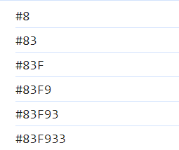

# 공부 기록

### 트러블슈팅

1. `backgroundColor.style.backgroundColor = "#000000"`
   직접적으로 문자열로 style을 적용하면 컬러가 적용되지 않는 문제 사항 발생

- 원인 : 기본값으로 rgb 컬러를 인식하기 때문에 hex 값을 가져오기 위해서는 'toString()' 메서드와 'slice()' 메서드를 사용해야 한다고 한다.
- 해결 : getHex의 return값을 string으로 반환

 

2. _Hex color 가 어떤 문자열로 이루어져있는지 알지 못하여 getHex 함수를 어떻게 작성해야하는지 어려움을 겪음_

- 해결 : getHex() 함수 실행 시 color 를 콘솔찍으면 다음과 같이 출력된다.
  
- for문을 총 6회 돌려 랜덤숫자를 += 해준다
