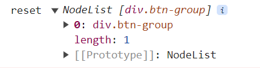

# 공부 기록

### 트러블슈팅

1. `document.querySelector(".btn-group")[0];` 시 undefined

- <b>원인</b> : querySelector는 문서에서 첫 번째로 일치하는 요소를 반환하고, querySelectorAll은 일치하는 모든 요소의 목록을 반환한다.
- <b>해결</b> : 하위 요소 선택을 위해 끝에 [0]을 붙여야 할 경우 querySelector가 아닌 querySelectorAll을 사용해야 한다 =>
  `document.querySelectorAll(".btn-group")[0];`
   

2. `const reset_btn = document.querySelectorAll(".btn-group")[1];` 시 undefined

- <b>원인</b> : querySelectorAll(".btn-group")은 .btn-group 클래스를 가진 요소들을 NodeList로 반환한다.   실제로 `document.querySelectorAll(".btn-group");` 시 다음과 같이 콘솔이 찍힌다. 따라서 [1]은 애초에 없다.
  
- <b>해결</b> : `document.querySelectorAll(".btn-group");` 로 먼저 btn-group 접근 후 하위 요소의 button을 [0],[1],[2] 로 접근한다
   

3. number의 값이 카운트 되지않음

- <b>원인</b> : `document.querySelector(".number").textContent`는 string을 반환함
- <b>해결</b> : parseInt로 감싸줌
   

4. numberEl.style.color = rgb(16, 42, 66) 적용안됨

- <b>원인</b> : rgb() 함수는 CSS에서 사용되는 표기 방식으로, JavaScript에서 직접 사용할 수 없다.
- <b>해결</b> : rgb색상 문자열로 변경

### 중요 개념

1. 자식요소 선택 방법 중 [0] 로 접근 가능 (트러블슈팅2 참고)
